banner: assets/sensornode1.webp

*Note: CTRL+click on any image on the site to view it blown up*

## Form AND Function 
- The bigger thing I want to talk about is a shift in direction for the idea itself.
- Something I really want to enforce in the development of this program is a heavy emphasis on visuals alongside functional design. Form AND function, not one as an afterthought of the other.
### Why Is Visual Design Important?
- The only stagnant attribute of any creation is the visual. Function is only understood in motion or on interaction. Feel is only understood on touch. But visuals transcend all of that — between moments of use, on first confrontation, you are solely met with them. They're the only dimension of a creation that exists irrespective of time. And because of that, they're constantly influencing the user on a fundamental, involuntary level. You have no choice but to internalize them. So if something can subconsciously shape the way a creation is perceived every single moment — why would you not place enormous emphasis on it? 
### A Unique Visual Language?
- Too often so many programs and applications look so similar and derivative. There may not be a practical benefit to achieving a unique, and perhaps esoteric visual style, other than enforcing the subconcious idea that the program is quite different, but its something I really want to experiment with and pursue. Innovation in both the form and function. 
### Why Does Almost Nobody Do This Well?
- Too many programs and applications look derivative. There may not be a strictly practical benefit to a unique, esoteric visual style beyond enforcing the subconscious idea that the thing is genuinely different — but that alone is worth pursuing.
- The clean minimal aesthetic is the norm for a reason, sure. But I think it's a lazy reason. Minimalism and the homogenous styling of most software today isn't using the full potential of the visual medium — it's putting Michael Jordan on the bench. A lot of this comes down to monopolization. Apple, which used to actually innovate visually, now just churns out minimalism as a substitute for design, barely iterating year to year. A scared, consolidated industry won't take risks.
- Graphic design has largely been reduced to being subtle — enhancing what's already there rather than saying something new. But why limit one of the most powerful dimensions of a creation to such a passive role?
- Why can't representational art live inside our software? Why must art be confined to colors, fonts, and if we're lucky, shapes? Why can't it permeate every aspect of a creation — so vividly, so ecstatically, that the user can't help but stop and admire it?
- One field that actually gets this right is videogames. The industry acknowledged the role of visuals and paid attention — and the rewards are obvious. Even limiting the comparison to 2D games, even limiting it to just UI and non-gameplay elements, the art style and world OOZE out of every corner. That's what I'm talking about.
 

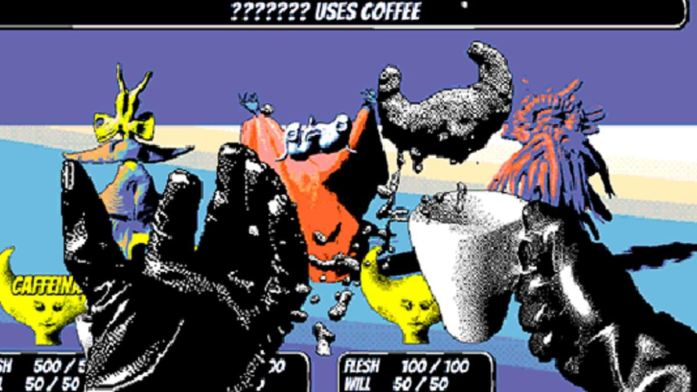

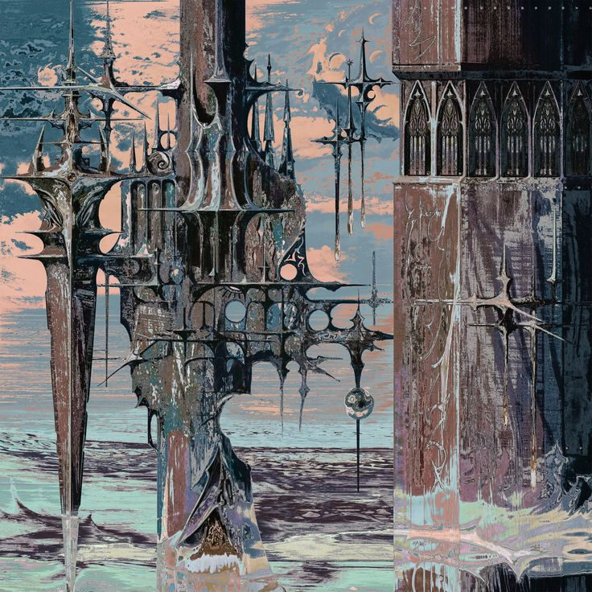

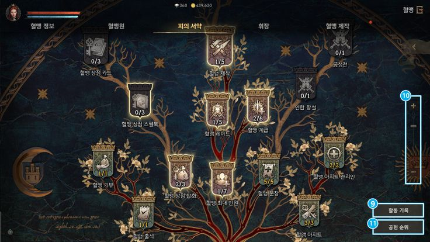

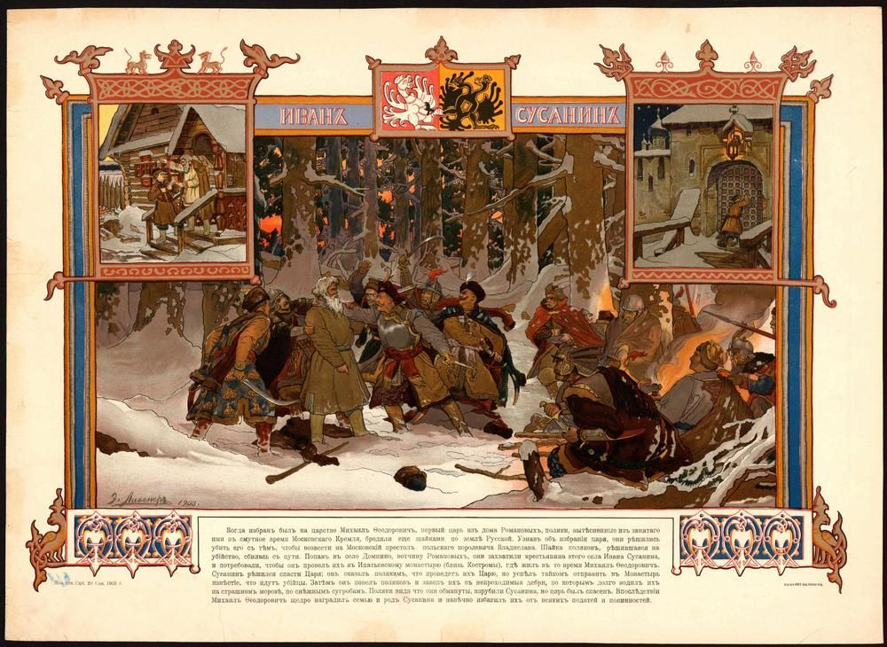

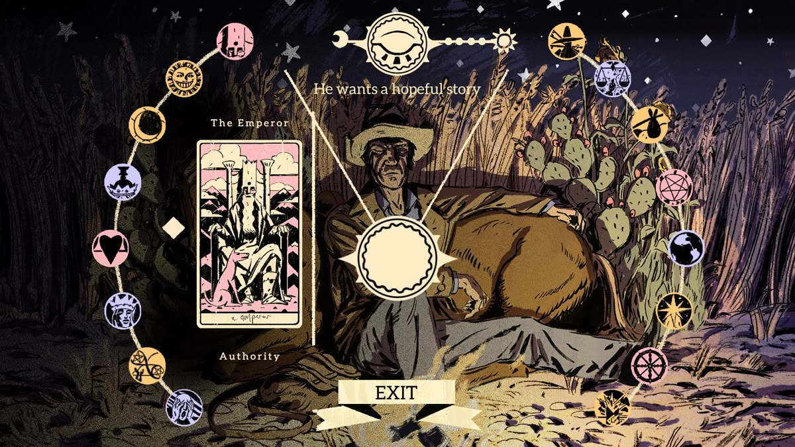

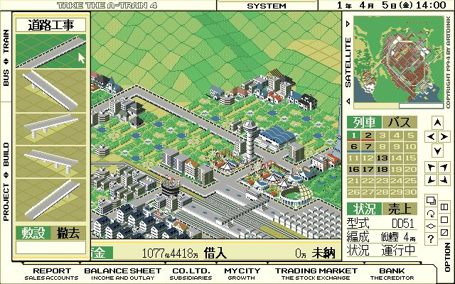

### Industrial Design
- The same applies to physical hardware (and industrial design largely). Companies like Nothing and Teenage Engineering are headed in the right direction but even they're still reluctant, still appealing to a safe demographic. Our world is full of artisans making extraordinary things. Imagine a product that took any of the following textures, colors, or shapes seriously:

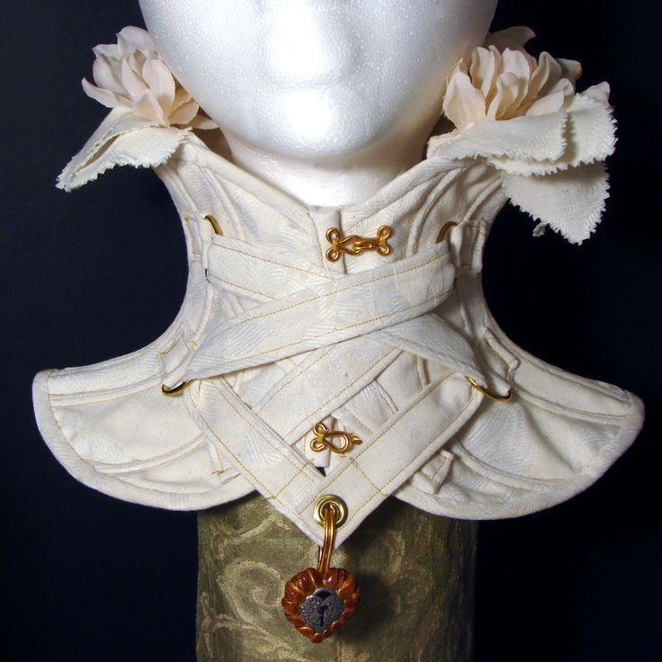

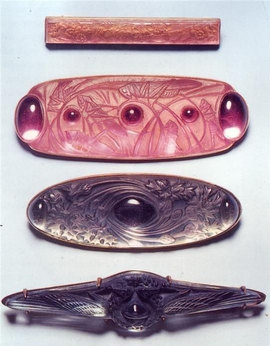

- A lot of these issues are nuanced — the obvious cause is how global economies are structured — but beyond that I think the way we view art as a society is deeply limiting the visual medium's potential. Art gets treated as this high-brow, pretentious thing, something only quirky expensive brands are allowed to sell. But beauty and visuals shouldn't be a luxury tier. They should come with the product, at a reasonable price, accessible to everyone — not gatekept by some idea that only incomprehensible geniuses can make or deserve it.
- For reference, some direct examples of what attention to unique visuals actually looks like in digital and physical creation. (Yes, one of them is AI — I have thoughts on that, but I'll save it):

*Imagine a water bottle inspired by this*

*Aesethic is a bit done to death but still cool*

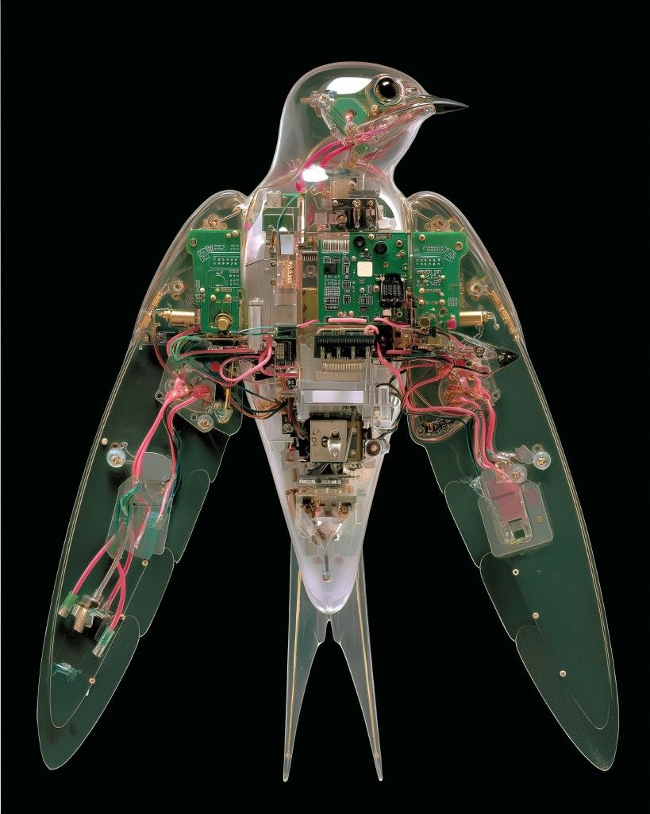
*This is AI but stil*

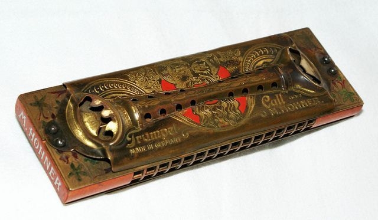
*Phenomenal design*

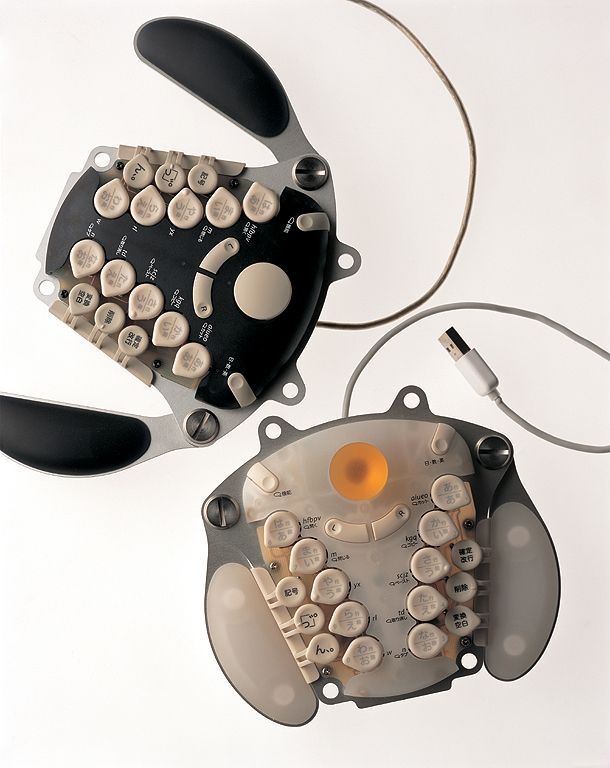
*A harmonica!! Less modern but still relevant*

*Kind of interesting, still not very innovative*

*Kinda a copout not quite software*

*Pretty interesting UI, not crazy though*

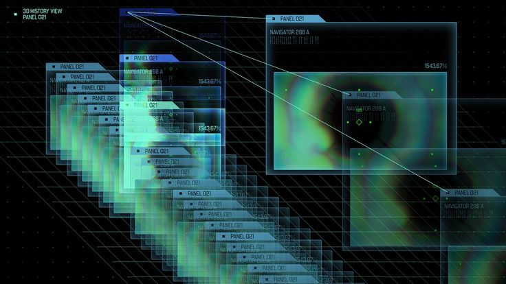
*Could be some sort of Xray imaging software*

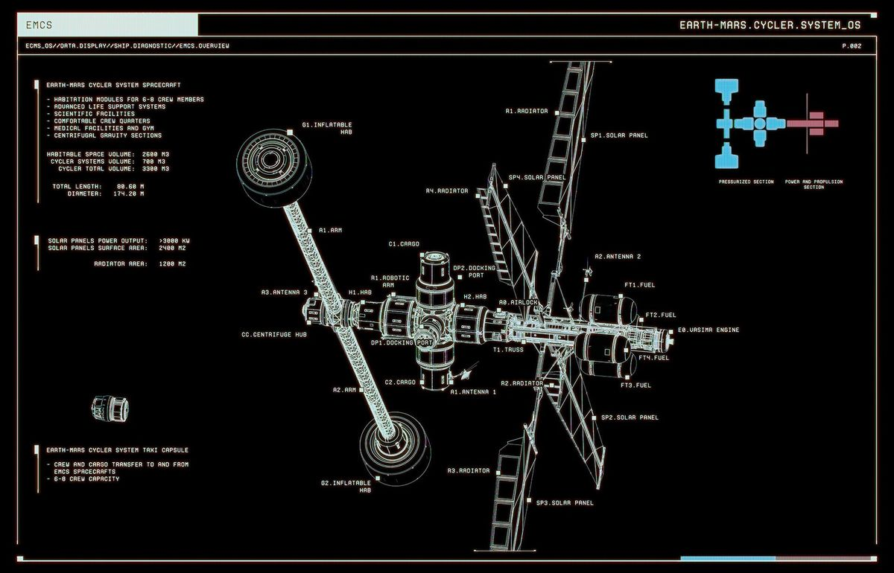
*Imagine an AutoCAD schematic viewer like this*

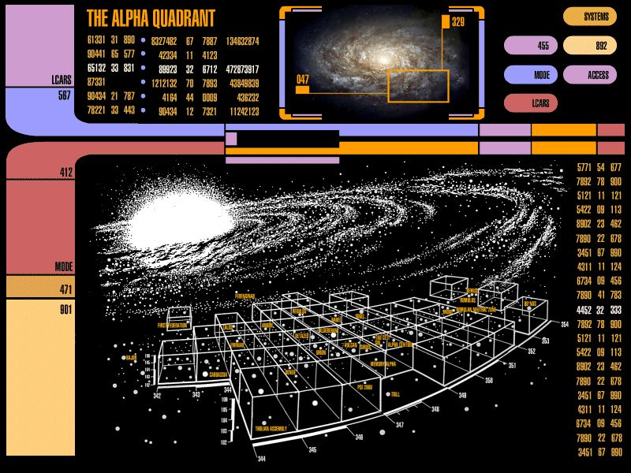
*Just a dope ah design*

*Linux ricing communities are great at this*

*Relies heavily on old asethetics but nice*

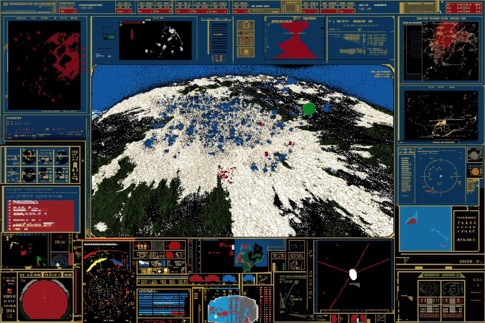
*AI but imagine an environemntal simulations sw*

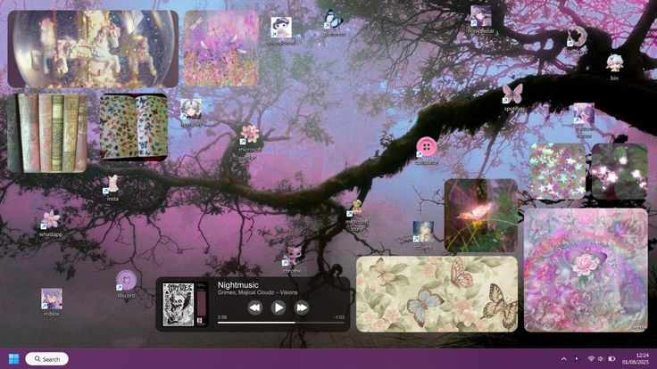
*Another cool rice (but on MacOS)*

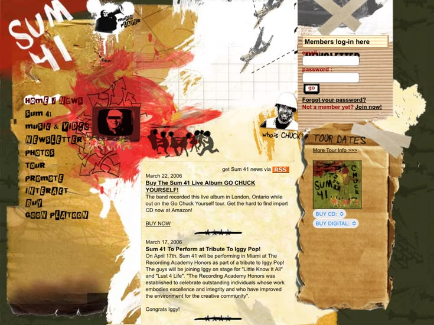
*Neocities type personal sites are also great*

 
## What This Means for Program 
- I'm not going to pretend I'll achieve any of that fully. But I at least want to try to make this look genuinely different from the standard notetaking app aesthetic — your Obsidians, your Notions. The goal is something bizarre and wondrous, synonymous with the strange workings of the program itself.
- Here are some relatively conservative early explorations of the style — still workshopping it:

The view will be split in two. Left side: spatial placement of data, relationships, visualized blocks of information. Right side: a representation of the data where things can be queried and the intricate emergent relationships are displayed. The specific data view I have the most concrete implementation strategy for is one where the children, parents, and spouses of a single package are shown alongside their interconnections.

*This is kind of what the full view will look like*

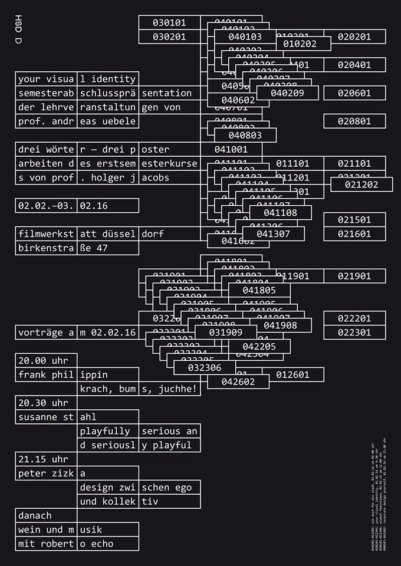
*The organization of the workspace side*

*The asethetic of the workspace side*

*The organization of the relationship side*

*The asethetic of the relationship side*

### How to Actually Pull This Off?
- The key is direct integration between engineering and design — between idea and execution. Concept art is a great model for this: the concept artist is simultaneously the designer and the executor of vision. Most engineers can't do visual design. Most designers don't understand the engineering deeply enough to design for it honestly. To make the best possible thing you have to fully understand what you're making — and most designers fail there.
- My point being: I'm already trying to push the functional design but I want the visual design to be just as intentional, woven into the function rather than tacked on after. The technicals will still be the driving factor — the code and progression of the application will steer the visual direction more than the other way around. But the visuals won't be an afterthought.
- One specific idea I'm excited about: a non-traditional grid system. Instead of a static conventional grid, I want wayward lines or curves that are actually formed between the packages — so when you move or resize a package, the grid shifts with it. A warped, living grid. Still figuring out how to make it functionally meaningful rather than just decorative, but the idea is there.
