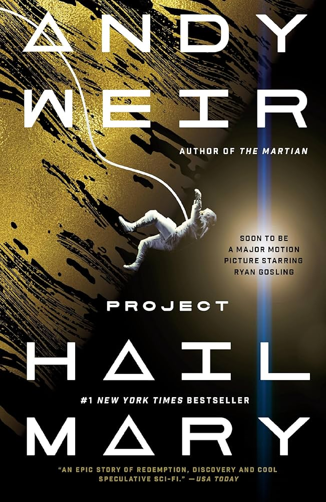
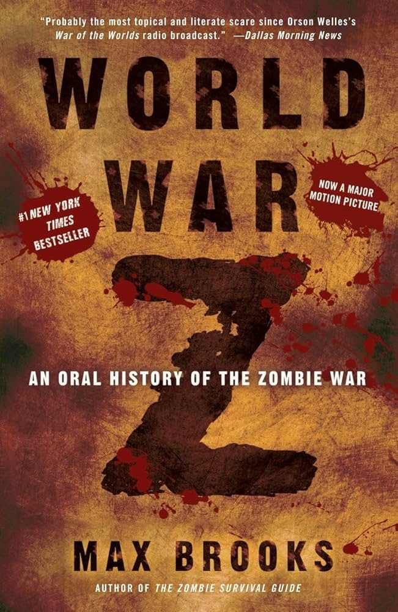
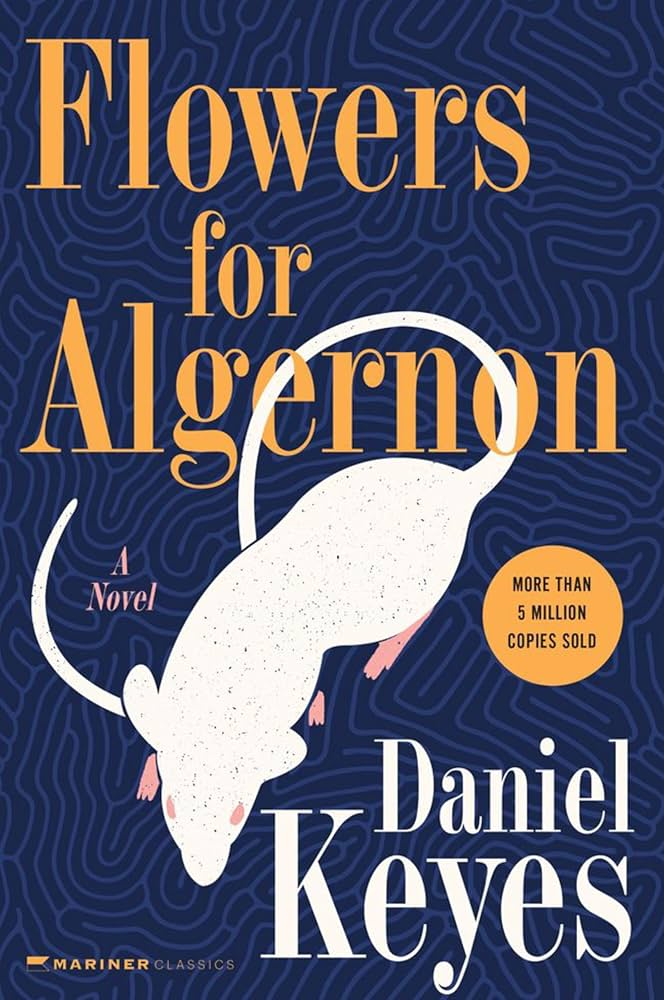
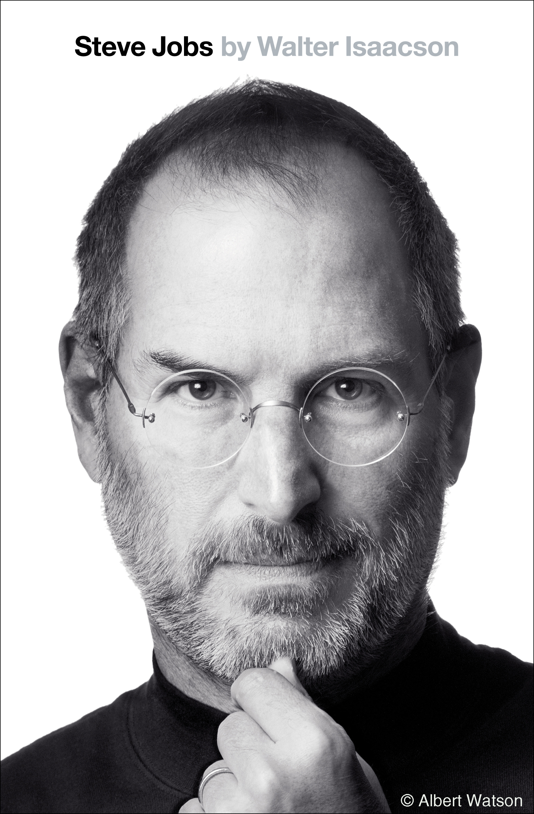
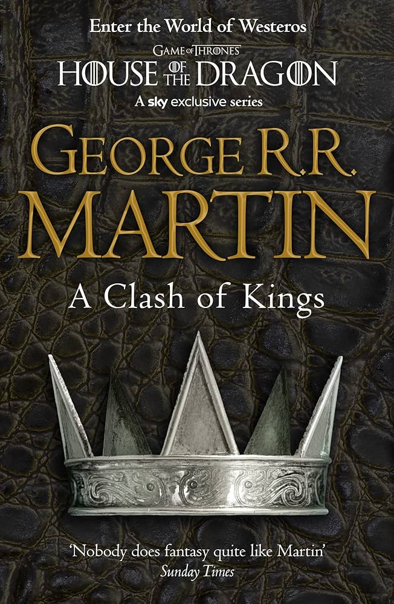
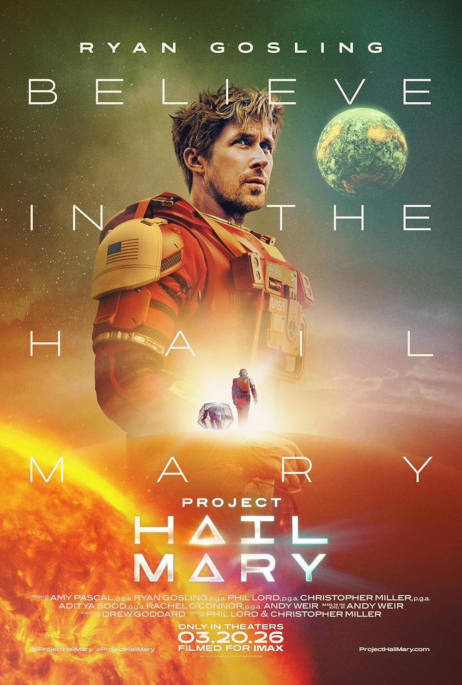

title: Consumption Log
banner: assets/shoot.jpg

- This is meant to serve as a log of the media consumption I participate in.

# Literature

*December 28th, 2026*

*January 8th, 2026*

*February 13th, 2026*

*March 22nd, 2026*

*April 21st, 2026*

# Film

*April 4th, 2026*

## Future Media Consumption: 

1. Land of the Lustrous by Haruko Ichikawa (Manga)
2. Outer Wilds (Adventure Videogame)
3. Twin Peaks (Television)
4. Godel, Escher, and Bach by Douglass Hofstadter (??? Book)
5. Absolute Batman (Marvel Comic)
