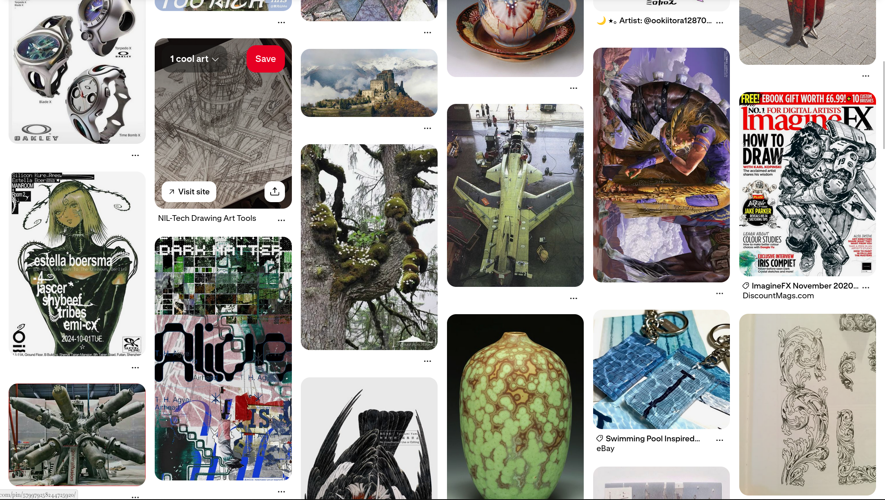
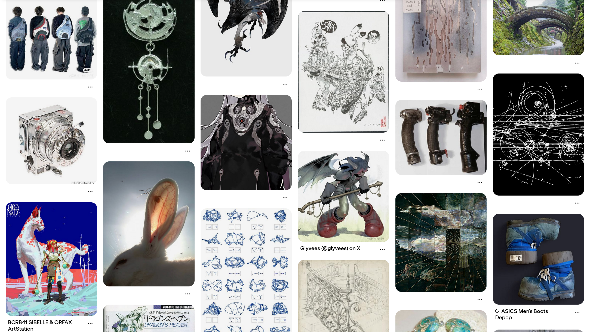
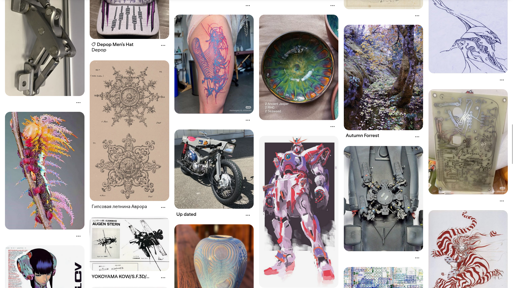
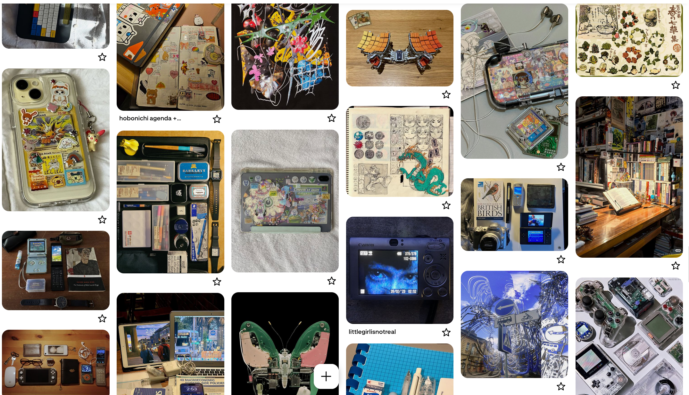

title: The Stand User Could Be Anyone
banner: assets/jojo1.jpg

## The Examined Life Looks Like Something
- As of late I have fallen down a rabbit hole of sorts. I've always really liked  Pinterest which kinda opened up into something I've been trying to put in words. This isn't a good example of what I mean regarding the people, more focus on the material but Pinterest is great at collecting really interesting cool things. Here is literally just my homepage (and a board)

- The examples don't really explain what I'm saying but if you've ever been on pinterest ykw I'm talking about. These asethetic interesting people that are presented on there. These people with style and substance. Depictions of them are collected and curated on there. Saying it like this makes it feel oddly dystopian ngl but all I mean to say is Pinterest acts as a platform where they are presented. 
- And seeing these people and what they interact with and how they look made me realize, "woah there's this whole world or community of people online who are just different." They aren't performatively wierd or acting some kind of way but living in a way that feels considered. They make things, dress interestingly, listen to music you've never heard of and actually know and have opinions on various things. Tumblr used to be where they all congregated.
- The words that kept coming to mind were creative or bohemian. Neither quite captures it but they're in the neighborhood. I'm a natural aesthete myself so I think I'm drawn to these people because I recognize something in them.

### Silknode
- Then I came across Silknode. They market themselves as a Pinterest-Tumblr hybrid built for this type of person. After watching their content on YouTube and Instagram I suddenly had a word for the thing I'd been feeling for a while. There they all were interesting and odd. One making electronic folk music, another sews their own clothes, one other trying to make it as a film street photographer. 

They were the exact type of people I'd been circling to name.

### The Common Thread
- Something kind of clicked and I realized the common thread amongst them all: intentionality. Not the music they listened to. Not them all being artists. Not even them being into fashion. It was their intentionality in living specifically... 

#### 1. Strong Identity
- They know who they are. It's almost like they had a conversation with themselves and actually sat down and figured out who they are and what they want to be (this could have occured subconciously). They also possess a settled quality in their movement whether they realize it or not. Confidence isn't quite the right word but they definately aren't performing an identity or auditioning for one. They've landed somewhere and are just living from that place. Most poeple inheret their identity from their environment, never questioning it and sinking into mediocrity. 

#### 2. A Take on Life
- They have a defined view of what life is to them (again, may be unintentional). There's a romanticism to how some of these people exist; beyond a series of rat races, obligations, and meaningless milestones, they believe it to be experienced experienced deliberately, something worth being present for. The way they approach evverything changes as a result of this. The very texture of a normal afternoon is completely different than that of another person's. They've really formed a defined relationship with their existance. 
- There's also other people in this group that have a more melancholy or depressing view of life but the point is, they have a stronger sense of it than most, whether it be intentional or unintentional.

#### 3. Alternative Trajectory
- This plays into the other, but they kinda have carved their own path, rejecting the default trajectory of life. The norm of grinding for a job they don't care about and life starting adn ending with school and work was something they didn't care about. They may have actively thought about how they actually want to live or didn't but whatever it may be, they have naturally oriented toward that instead — even when it's harder, and even when it's less legible to the people around them. Having a strong sense of self and idea of life disillusions yourself from the whims of those around you and also the societal repressing, preconcieved notions about what a "well lived life" are.

- The opposite of this person is someone whose identity is mostly inherited like default settings. They like what they're supposed to like, dress how their peer group dresses, floating through life, aimlessly. The herd ahead of them leading their path.

### Fashion as a Confession
- If you're trying to read this quality from the outside, look at how they dress. **Fashion is like wearing yourself on your sleeve**. Your aesthetic sensibilities, your references, what you find beautiful, the attitude you want to project all ends up in the clothes.
Someone who has done that interior work almost always shows it in how they put themselves together. Not neccesarily expensive or even conventionally well but with a point of view and a level of coherence that gives a sense that it was intentionally (chosen rather than followed).
- Pair that with how someone carries themselves and how they talk: whether they have genuine enthusiasms, real opinions, a curiosity that actually goes somewhere. You can then begin to get a reading on a person incredibly quick.

### The Word I've Come To
- Examined. These are people living examined lives. They've looked at the options and made actual choices. This sounds very simple but I don't think most people do this. 
    - I'm drawn to cities because that's where you find them mostly which makes sense. Cities self-select for people who made a deliberate move somewhere and the density lets subcultures breathe. A lot of internet communities kind of emulate this. 

I'm still figuring out what all this means for me and how I can become like these people but figuring this out feels like the first step. Honestly making this site was a big part of consolidating my identiy and really forced me to define it in a lot of ways I wouldn't have otherwise. Reading through this site you can get understand a large part of me and how I think.

## Art Share
- This isn't really pertaining to the material but I wanted an excuse to share some interesting artists that I remembered when picking the banner for this post. 

### Min Yum

images{assets/minyum/}

### Gary Vanaka

images{assets/gvanaka/}

### Kei Urana (Gachiakuta)

images{assets/keiurana/}

