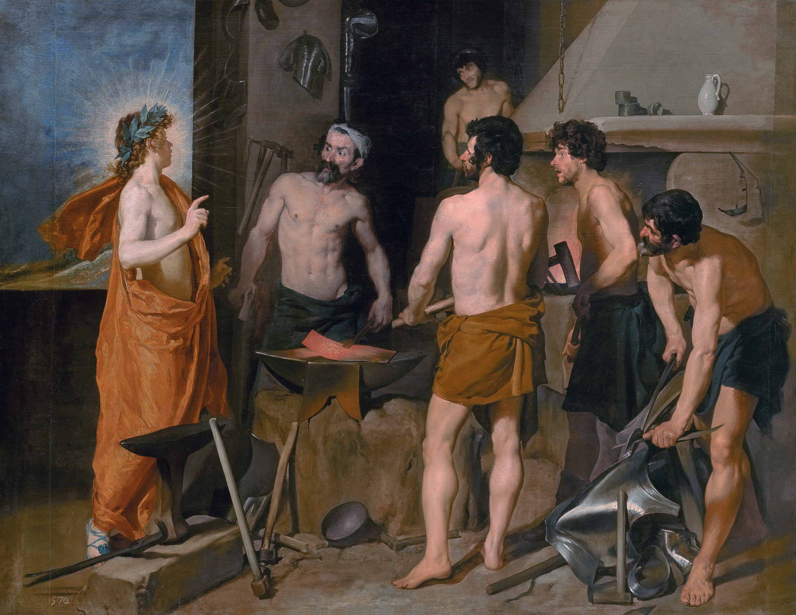

## Welcome

Welcome to my **Wunderkammer**! I'm **Param Ghetia**, a **sophomore** studying **Computer Engineering** at **Rutgers University** and minoring in **Mathematics**.

I'm interested in **computation, mathematics, physics, and intelligence**, especially in systems where simple rules, abstractions, or architectures give rise to complex behavior. In these systems, I like working on everything from the physical hardware to abstract algorithms.

I'm less so attached to any particular industry or field than I am to environments where there's something new to learn, an interesting techincal problem to solve, or room to create something new. Most of what I've been building as of late revolves around emergence, abstraction, simulation, and unconventional computational representations.

## Selected Work

**[[projects/vivarium|Vivarium]]**  
An experimental graph-structured engine for constructing, simulating, and eventually learning over dynamical systems.  
*(Python | graph systems | numerical simulation)*

**[[projects/akashom|Akashom]]**  
A knowledge system built on graph theory exploring more intuitive and efficient ways to organize, query, and navigate interconnected information. 
*(Svelte | Electron | TypeScript)*

**[[projects/cornocupia|Cornocupia]]**  
A terminal-based inventory and logging system I built to help me keep track of the stuff I buy, how much I have or use, and where I put it.  
*(C | ncurses)*

**[[projects/mindscape|Project Mindscape]]**  
A long-running worldbuilding and writing project exploring an axiomatic power system and the absurd world it spawned.  
*(worldbuilding | systems design | writing)*

## Current

Currently, I'm working on Vivarium while studying digital logic, differential equations, electromagnetism, and linear algebra. I'm also exploring theoretical computer science and graph-based models of computation.

See [[currents|Currents]] for what I'm working on now, or [[about|About]] for more about me.

 
 

*A work by my favorite classical painter: Diego Velázquez, The Forge of Vulcan.*

