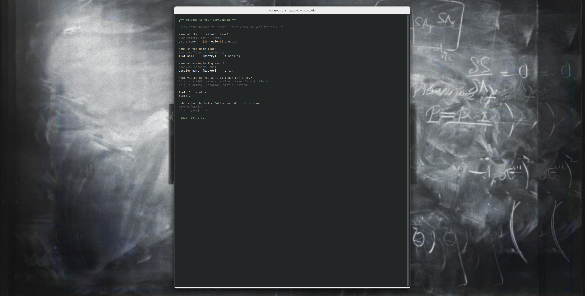
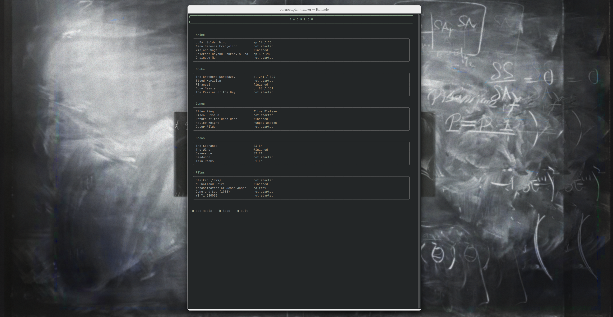
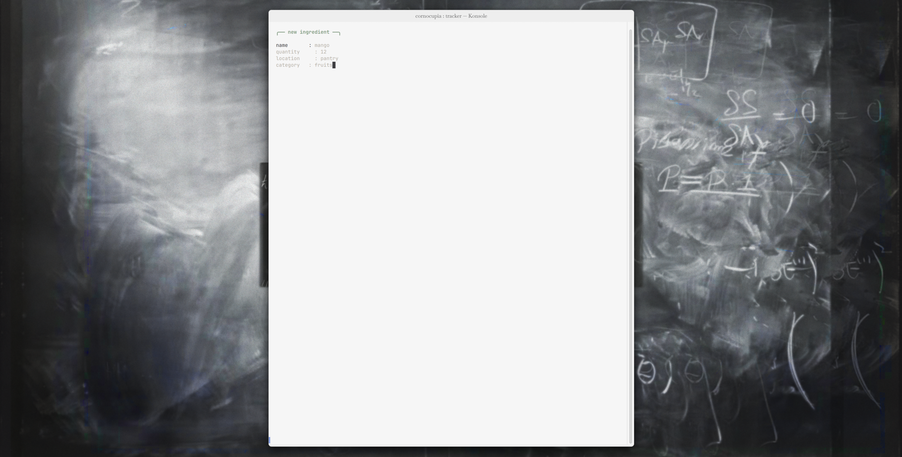
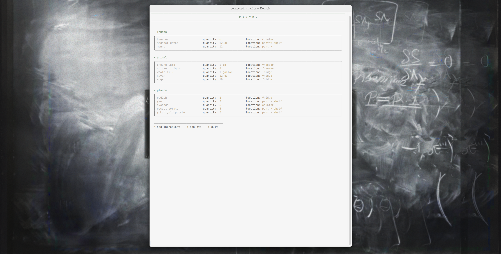
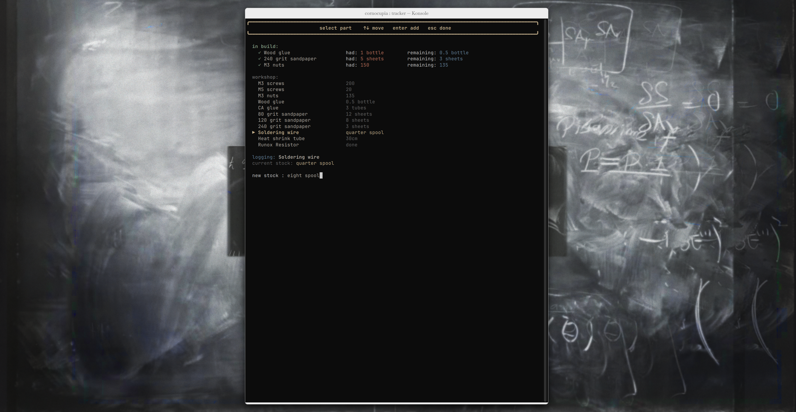
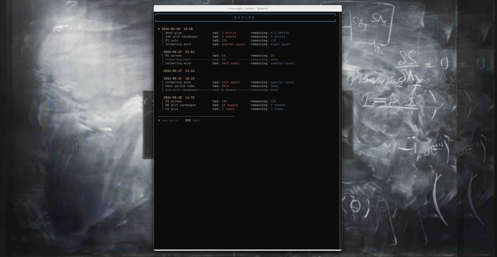

banner: assets/nazar0199.jpg

This program isnt really innovative or unique. It's mainly just something to make a part of my life more convenient. An issue I tend to have is I lose track of things. Whenever I get groceries, I forget what I have and what I've used and when. I also often lose track of my art supplies and how much I have left or which I have. 

So to solve this, I've created Cornocupia which is just a simple terminal tracker for anything you own or work through. You define what you're tracking — books, games, groceries, workshop supplies, whatever — and it keeps a live list with a number of fields per item like status, location, etc. Whenever you make changes to your inventory and use something or make progress, you open a session and log what changed: where things were, where they are now. Over time the session history becomes a record of consumption and usage. And everything is stored in a JSON file which is easily readable and editable. 

So when you choose to open a new pantry, it will prompt you for the labels for the pantry so I could really customize it for my needs. You can see this below:

For reference, after a while of usage, you will then have a pantry (or in this case a "backlog") that looks like this:

Once you've created the pantry, you then can add ingredients:

Now that you have a built up pantry, you can log the usage of items and the changing of fields by adding ingredients ("parts" here) to a basket (in this case a "build")

For reference this is what the builds page would look like after you do that. You can see a log of all the previous builds:

As you can see I have 3 setup, 1 for media consumption, another for my grocery list, and another for workshop inventory management. This program isn't too creative or crazy but it fills a niche that I needed covered and is interestingly customizable and fits a large number of my use cases despite being so simple.
