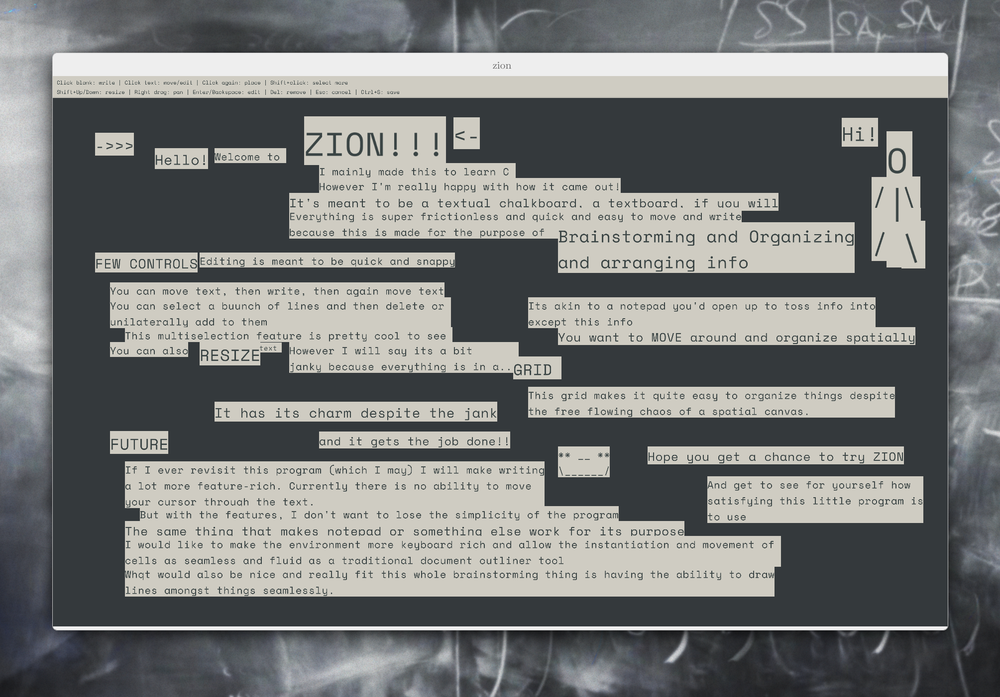
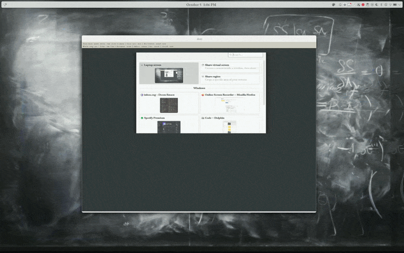
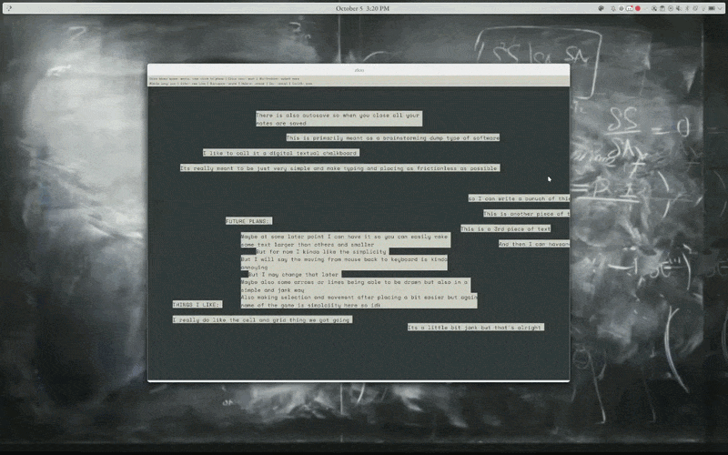
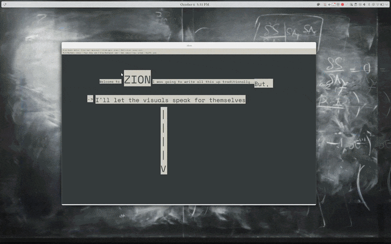
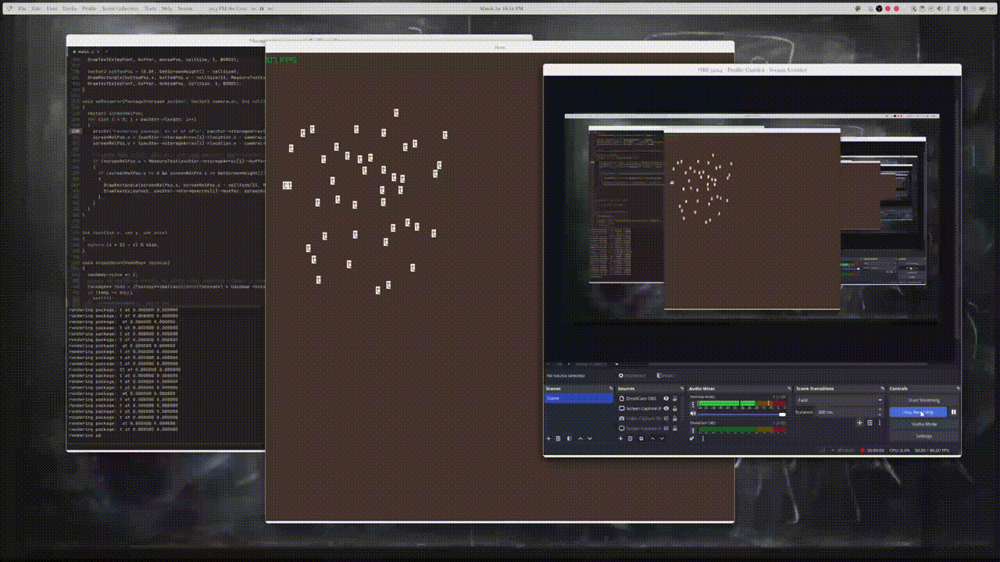

ZION is a spatial text editor. I like to glorify it as a textual chalkboard, or a textboard, if you will.  
My primary reason for creating zion was wanting to improve at C, but a secondary reason grew: it seemed fun to make a spatial text editor. 
It had humble beginnings as a ncurses project where it existed in the terminal. This ended up crashing and burning as a result of changing my goal with my project far too late, with an already existing foundation that couldn't bear the load above it. So, I switched to using Raylib (graphics engine built atop OpenGL) and C, with a clearer vision in mind. 

## AI Usage
- With this project, my AI usage was incredibly minimal. For the majority of the codebase (at the time I made the project) I didn't even really have access to AI coding tools. Coming back to it many months later, in an effort to finalize this project as of recent, I used codex to refresh me on the project/state of code, clean up some loose ends, and help sort out some bugs so that this project could be "finished". I really tried to keep any changes minimal and I think I for the most part achieved that goal as most of the architecture and majority of the algorithms remained my own. 
- Mainly, it added tests as well as helped me impliment better selection and changing cell size. 

## The Vision:
Again, this project isn't too large but my goal was to make a nice brainstorming/braindumping digital tool. I really like working with things on paper but wished I could move things around and change the order of things. I wanted to kind of make this into a very minimal simple program that I could just quickly open, throw stuff into and close, allowing for the chance of later revisting and revising.

This isn't really new but I wanted to just make one for myself, something very simple and barebones: akin to the form and function of something like notepad.

## The program
- So this is a sample of what a zion file could look like: 

### Workflow

1. You click to start typing and this cell follows around your cursor as you type (this actually started out as a bug that I ended up liking) until you click once more. 

2. Once you have placed a cell you can click it again to employ the same behavior from earlier (edit it and move around) or you can select it. 
3. You can select multiple cells and now you are employing the behavior from earlier on all of them, meaning you can backspace or type or make new lines, affecting them all. 
4. You can also move the cells around all at once. 
    - The visual of everything moving and being edited is quite satisfying 
    

5. You also can scale up and down the selected cells. 
6. And whenever, you want, you can close it since there is "autosave" (really everything is just saving everytime you do something since there is no undoing and every action is more or less permanent). 
    
- As zion is meant to be a textboard, it naturally is infinite meaning you can pan infnitely for each file writing as much as you want (or as much as your local memory allows). Unfortunately, I have not yet been able to impliment zooming smoothly (always some kind of bug or undesired behavior)

- Despite zion having a practically nonexistant UI nor any visual feedback, it still feels quite satisfying to use (and I'm not just saying that because I made it).  

## Future Features
- Zooming
- Lines between cells
- More text editing features
- Better keybindings and keyboard workflow (making it very quick and effecient to use) 

- I likely won't come back to this stuff anytime soon though
## Reflection
- Zion will always have a special place in my heart. It was one of my first serious coding projects and It was some of the most fun I ever had debugging and designing algorithms. The biggest thing I learned was that C is damn hard. But its the good kind of difficult. I would love being tasked with this algorithm I have to impliment and then have to work through it keeping in mind memory management. I really went out of my way to learn new data structures and impliment them in C. So, yes, if I had done this project in python it may have been much much easier and much much quicker but the fun I had in trying to keep track of all these things and really thinking through the memory operations was well worth it. However, an unfortunate effect of using C and a result of my development style at the time, I wrote very few comments and implimented complex, and now incomprehensible algorithms, riddled with C idiosyncracies. I also did not expect it to grow to the length it did and left everything in the same file which I have since learned is not great practice. 
- Anyways, even though I wrote zion many months ago, it is by far one of the most algorithmically impressive projects I've worked on. One that gave me a very very strong understanding over the C language. Unfortunately, that knowledge has since dwindled and my code is far too difficult to understand and expand so I likely will not further work on this project. I will continue to still use ZION time to time and cherish it as the project that brutally taught me C. 

## Development Process
- I worked on this a while ago so I unfortunately don't remember most of the issues I had in the development process but, I do have some gifs of this particularly pesky bug. Essentially, I was experiencing large amounts of lag and performance issues as the number of cells grew and I tried panning around. I expected some graphical performance drops but the amount there was was absurd. You can see as much in the gif below. 

Turns out the issue was actually that I had a bunch of print statements every frame. So in between the graphics cards calls, the CPU was being called upon to print some statement. This constant discontinuity in actions resulted in a lot of performance ineffeciency. Forgive me if I am wrong and this is not the issue, it has been quite a while although I do think that was the case. 

