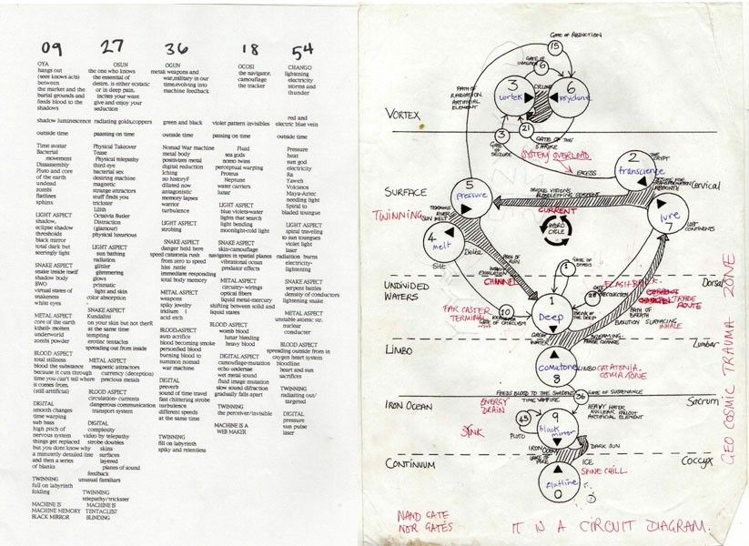
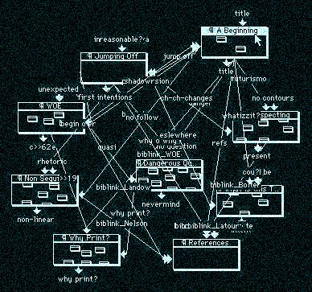
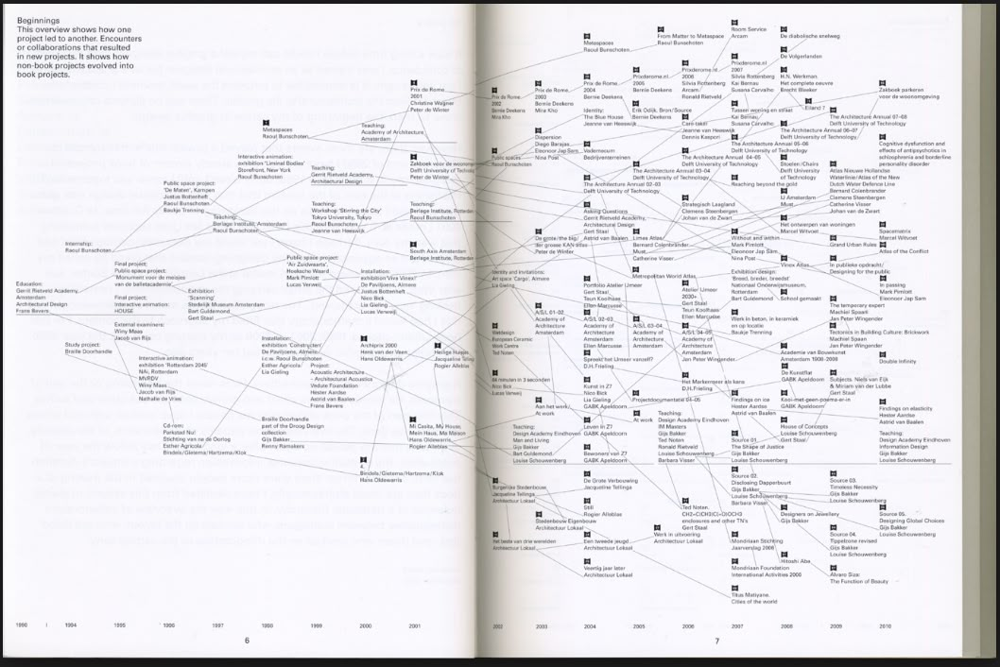
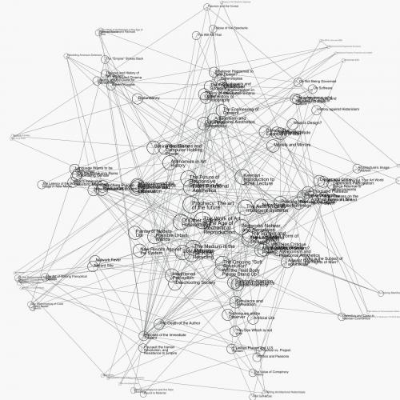

03.21.26

This devblog will be a little less formal and thus the writing may be much less precise. I apologize

Let me begin. 

Technicals-wise, it was quite boring. Most of it went into rewriting my program to use hashmaps rather than matrixes which was pretty complicated since I had to restructure a bunch of things and learn a lot more about hashmaps. I had only a general idea of what hashmaps were and how they worked but had never actually implimented them, but they're actually fantastic. Wonderful data structure. Funnily enough, in my last project (before I was aware of hashmaps) I encountered the issue of matrixes having too much empty space and wondered if I could just store the locations and the data in an array. What I ended up doing was having an array with a data structure that contained the location and the thing I wanted to store and everytime I added stuff to the array, I made sure to sort it by location so searching was incredibly fast. Not a bad solution I say. The issue with that is searching by location even with binary search is not as fast as with a matrix. The middleground here being hashmaps. This will help me achieve the support for incredibly deep uses of the software, when the user has a root package of enormous sizes, every little bit of memory I can save will be worthwile. 

Okay that's enough of the technicals, I would like to share a large change or direction I intend to head in in terms of the idea. Something I really want to enforce in the development of this program is a heavy emphasis on visuals alongside functional design. An emphasis on form AND function.

### Why Is Visual Design Important?
- The only stagnant attribute of anything is the visual. Creations follow this rule as well. For them, their function is only understood in motion or upon interaction and the feel of the creation only understood on touch. THe visuals trascend this. Between the moments of usage and on the initial confrontation, you are solely met with the visuals, the only form that exists in stagnation and irrespective of time (I'm not really talking about animations or videos here). I'm also writing a Mindfill post talking more about this aspect of visual art and how that makes it so much more important for us as a society to place an emphasis on. The visuals are the thing influencing the user's or viewer's mind and how they interact with the object on a fundamental, involuntary level. You have no choice but to internalize the visuals (unless you close your eyes I guess lol). So if we have something that can subconciously effect the way the creation is viewed or used every single moment, then we would be foolish not to place large emphasis on it.
### A Unique Visual Language?
- Too often so many programs and applications look so similar and derivative. There may not be a practical benefit to achieving a unique, and perhaps esoteric visual style, other than enforcing the subconcious idea that the program is quite different, but its something I really want to experiment with and pursue. Innovation in both the form and function. 
- Perhaps the clean, minimal visual style is the norm for a reason but, I think there's some value in making use of such a powerful aspect of creation: the visuals. Minimalism and the homogenous styling of many websites and apps nowadways is not using the full potential of the visual medium.
- I'm not going to act like I'll achieve that, but I would like to at least try to make my program look a little bit different than many of the simple notetaking app looks like Obsidian and Notion. My goal is to achieve a bizzarre and wondrous visual style that is synonymous with the strange workings of the program.
- I have some relatively conservative examples listed here (I'm still workshopping the style and look)
#### Examples
- For context, I'm going to be splitting the view in two, the left side will be where data is spatially placed and relationships are formed and blocks of information are visualized. The right side will be a representation of the data where things can be queried for and all the intricate emergent (read more in this [blog post][https://parmenides07.github.io/wunderkammer/#theMindfill/03-21-26%20Emergent%20Complexity%20and%20Control.md]) relationships will be displayed. The data view I mainly have a concrete implimentation strategy of is the one where the children and parents and spouses of a single package are displayed as well as the interconnection amongst the ones that appear.

*This is kind of what the full view will look like*

*The organization of the workspace side*

*The asethetic of the workspace side*

*The organization of the relationship side*

*The asethetic of the relationship side*

### How?
- Below is very rough. WIP, need to refine.
- Must have direct integration between engineer and design between idea nad execution. Concept art is a wonderful example of this they are the designers and exactors of vision. Too often are engineers not profecient at functional design or visual design and too often are designers not knowledgeable about engineering. To create the best product possible you must fully understnad your product, most designers fail in this regard, they lack a true understanding of the technicals. Most engineers fail to see vision and are just simple technical executors.
- Anyway my point with this is that I'm already very on top of having innovative functional design but I also want innovative visual design so I want to have that deeply integrated in the actual function of th eapplication and not just an afterthought tacked on. Nonetheless, I will ensure the technicals are the driving factor of the visual style as the code and progression of the application will likely be the steering factor / limiting factor rather than the visuals. 
- Specifically though I have this one idea for the grid system although I'm not too sure how I can make it compliment the function or have a function, I don't wnat the grid to be traditioanl at all, I want to have wayward lines or curves but this shold be based on the packages so if I move the packages they should hcange too, maybe the grid is formed between the packages and so when you resize or move they move too. It may be interesting to impliment a warped grid of sorts.
