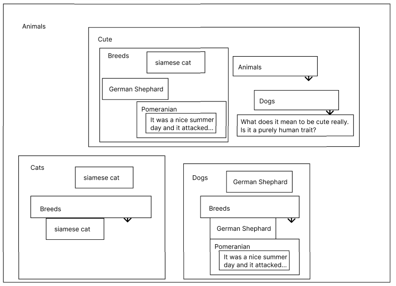

This is meant to serve as the singular Zion introductory document. 

I'll start with some context, I've always felt that other notetaking apps were too limiting like Obsidian or notion or Emacs Org mode. What I'd constantly come back to was just using paper and drawing these very abstract relationships between information. Having that spatial freedom really helped with refining ideas and ideating but one thing I missed was the digital ability to query for information. This is where zion began: as a spatial notetaking software. However, as I continued development, I noticed another flaw of many note taking apps. Most text editors would have a heading (the parent) and then children but these children can only have that one parent. I found this icnredibly limiting and forced me into this linear way of storing information. So this brought me to where the development of zion is heading now.

### AI Summarized Version (I Yapped Too Much)
**Zion** is a spatial, relational notetaking app built around a fundamentally different way of storing information. Instead of documents with headings and bullet points, everything in Zion is a package -- a self-contained unit of information that can be anything from a single word to entire paragraphs.
**The core model:** Packages don't live inside documents. They exist independently and form explicit relationships with each other. There are three relationship types: parent, child, and spousal. Parent/child is familiar from hierarchical notetaking, but with a crucial difference -- a package can have unlimited parents and unlimited children simultaneously. Spousal relationships bind two packages together as equivalents, neither containing the other. The viewport and everything the user interacts with is just a visualization formed at runtime based off of this raw data.

**Why this is different:** In traditional notetaking, "German Shepherd" lives under "Dogs" and nowhere else. In Zion, "German Shepherd" can simultaneously be a child of "Dogs," "Breeds," and "Cute Animals" -- because that's genuinely true. The diagram illustrates this: the same packages appear in multiple contexts, not as copies or links, but as the same object viewed from different relational angles. 
**Emergent relationships:** From just three primitives, a rich family tree emerges automatically. Two packages that share a parent become siblings. A parent's sibling becomes an aunt or uncle. These are never manually declared -- they're computed on demand from the underlying graph. The system also intentionally allows paradoxes: Animals contains Cute while Cute contains Animals. This isn't a bug, it reflects how human knowledge actually works. This is a great example of [emergent complexity](https://parmenides07.github.io/wunderkammer/#theMindfill/theMindfill.md).
**The real power is querying.** Rather than searching for tagged strings, you traverse the relationship graph. The example given: "find nephews of German Shepherd whose grandparent is Dogs" -- this returns children of other dog breeds, surfacing the story about the Pomeranian attack without ever having explicitly tagged or linked it. You're querying the structure of your knowledge, not just its text content.
**The vision:** A second brain that builds itself. As you naturally write and connect ideas, Zion constructs a dense queryable knowledge graph without requiring you to maintain tagging systems, manually create links, or organize files. The relationships form through use, and over time the database becomes a powerful reflection of how you actually think.

### Full Version
Let's begin. Everything in zion is stored as a package of information. Packages can be anything from a single word to entire paragraphs. These packages can have one of 3 relationships with otehr packaages, child, parent, or spousal. A child and parent relationship is what you're likely familiar with from hierarchical notetaking. However, here, packages (info) isn't stored on documents, tied to a single package. Instead, we store the packages themselves, and the relationships between them and then create a visualization at runtime. This allows us to have infnite parents or infinite children of one package. Now, spousal relationships is the linkage of two packages. You can think of it as similar to obsidian's linking with 2 major distinctions: 1. it is a linking of individual pieces of information rather than entire notes and 2. its not a link or a address or a copy of the package, those packages are bound. Now this seems somewhat simple but where this program shines is the [emergent complexity](https://parmenides07.github.io/wunderkammer/#theMindfill/theMindfill.md) that begins to form. This simple spousal, child, and parent relationship, over time can grow into complex paradoxical familial package relationships. 

This brings me to an explanation of the viewport and the way the user interacts with the program. There are 2 sides to this, the workspace and the data side. The workspace would have one package centered and all of its children and their spouses present. The children will then have their own children and you can begin to picture this recursive view (for the sake of memory and clear visuals, there will be a folding and unfolding system) You can then write stuff and if a package with the same text is found, what you wrote will become another instance of that package and it will automatically note down the parent relationship with the package it was birthed in. All the changes you make to that package will be changes made everywhere of course, since they are all just displays of the same package. They are not copies or links to the original package, but they are other instances of the same thing. Now the other view is the data one. This is where the relationships of the package selected will be shown, all of their parents and children and spouses and then the connection betwixt them. This will be one view, but also this is where you query for information (which is the point of having such a well connected database). The idea is that these relationships will form with very little input and you will naturally create an extensive database to pull from unlike in Obsidian where you are required to manually link things and mantain tagging structures, etc. 
For a better understanding of the visuals of this, see Devlog2.

Ideally with this program you are able to naturally create an enormous zettlekasten, second brain system that has linking and relationships on a informational level that can be effortlessly queried and pulled from.

To demonstrate this I have prepared a very rough and constrained example:

So a couple things to notice here:
1. We can see the folding system implimented to prevent too much visual noise. In the actual program the rendering will just be limited (because you can't make out letters of such a small font size), until you then unfold the package. 
2. Besides that though, our view is centered upon Animals. For this program it would likely start out in some root package, maybe Life and within that would be EVERYTHING, life would be the parent to every single package. The Adam of all the packages lol. And of course there is nothing stopping you from putting life inside of a package that is inside of life. Anyways, getting back on topic, there are a few child packages within Animals: Cute, Cats, and Dogs. These each have their own children like breeds. You may also notice that that same package is also a child of dogs, making german shephard and siamese cat siblings. This is an example of an emergent relationship. Also take notice of how German Shephard is a child of both breeds and dogs forming a whole host of contradictory relationships (breeds is the parent and sibling of siamese cat). This is a very natural usage of this information too, its not like I picked some obscure use case. It makes sense that if you had a document in which you were discussing cats you may write a subheading discussing breeds of cats and in there, you would put siamese cat. 
3. Note the paradoxical nature of some of these relationships. The program won't limit you from having these as that's how the human mind thinks sometimes, creating relationships that may be impossible. This is the power of emergent design, creating the base principles of a system and allowing it to form complex products. Here you can see that pet breed is a child of dogs yet in cute it is a sibling of dogs. Similarly, cute is within animals and animals is within cute. Its a perfectly normal thing to say that Animals have the quality cute, as in animals are cute and then as a seperate idea, animals are something that is cute, contained within cute. This is a perfectly normal thing to say yet it is paradoxical. **Perhaps I might impliment a 4th type of relationship that forms when something is the parent and the child of the thing** but for now (I haven't been through the horror of coding the visuals of this recursion yet) I will keep it because it sounds pretty dope. Another side note is that in the ideation of all this, I came across a lot of interesting traits of language and linguistics. I may make a blog post on that. 

This is a one to one replication: 
## Animals

### Cats
- Breeds (REPEAT)
    - Siamese Cat
### Dogs
- Breeds (REPEAT)
    - German Shephard
    - Pomeranian
        - It was a nice summer day and then it attacked

## Cute 
- What does it mean to be cute really? Is it purely a human trait?

This is how the same info would look if you'd have written a document on it (rather than tried replicating the zion version)
## Animals

### Cats
- Cat Breeds
    - Siamese Cat
### Dogs
- Dog Breeds
    - German Shephard
- It was a warm summer day and then the pomeranian attacked me.
### Animals Are Cute
- What does it mean to be cute though? Is it a purely human trait?

Now lets say you wanted to pull any relationships you have with german shephards for wahtever reason, maybe you're trying to remember your past experiences with them or whatnot. Querying for german shephards in zion, you'd recieve countless results with relationships and using the parents relationships and maybe restricting anything that shares a parent with dog or maybe restraining to, you can find practically whatever you'd want. Do that with the document style of notetaking, maybe if you're using Obsdian you would get lucky and get some notes that YOU TAGGED with German Shephard or linked to, SOMETHING YOU HAD TO DO, but at most you will just recieve every instance of just the string. Even in this above example if you wanted to get all animal breeds you've spoken about, by querying pet breeds you wouldn't even get that in one place, you'd get every instance of breed and then have to look at the text and pull it yourself. Another example, german shephards in the document is limited, you really can't do much with it other than know its a pet breed. In zion, you'd be able lets say if you wanted to find out attributes or stories you have with dog breeds like german shephards, you can query for nephew packages of German Shephard that have the grandparent Dogs, what that would do is find all the other packages in pet breeds that are dogs and return their children and then I'd get the story about me getting attacked by the pomeranian. These aren't perfect examples of the power of this, but you can start to get an idea of what's possible with this program and with a large database of information what could be possible.

Some may see this as pointless and unneccesary but the best way to view it is a robust storaage system for information and data in a notetaking context that facilitates the querying of this data through [emergent](https://parmenides07.github.io/wunderkammer/#theMindfill/theMindfill.md) relationships. I know this would be perfect for the way I think and structure information so I'm sure there are others like me. Be that as it may, I'm still reall excited about this project and the potetnial it has even if no one will ever use it lol. 
