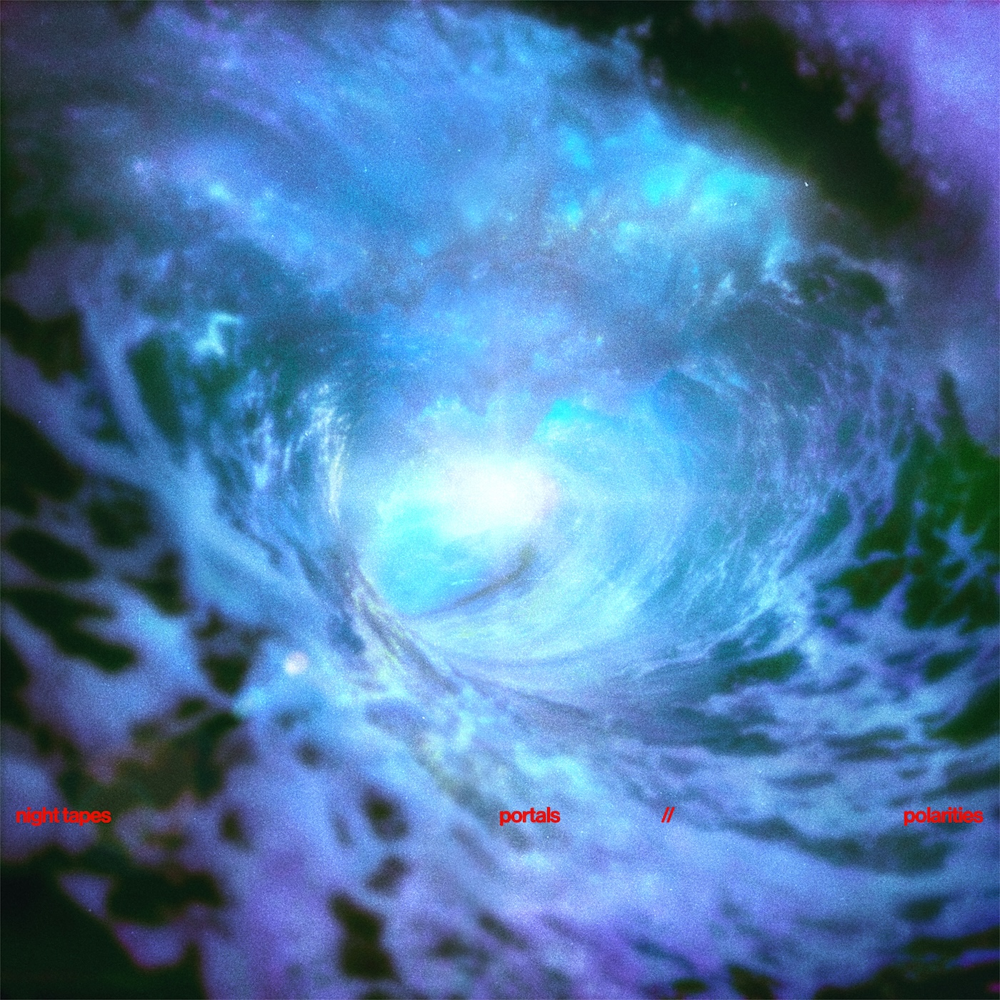
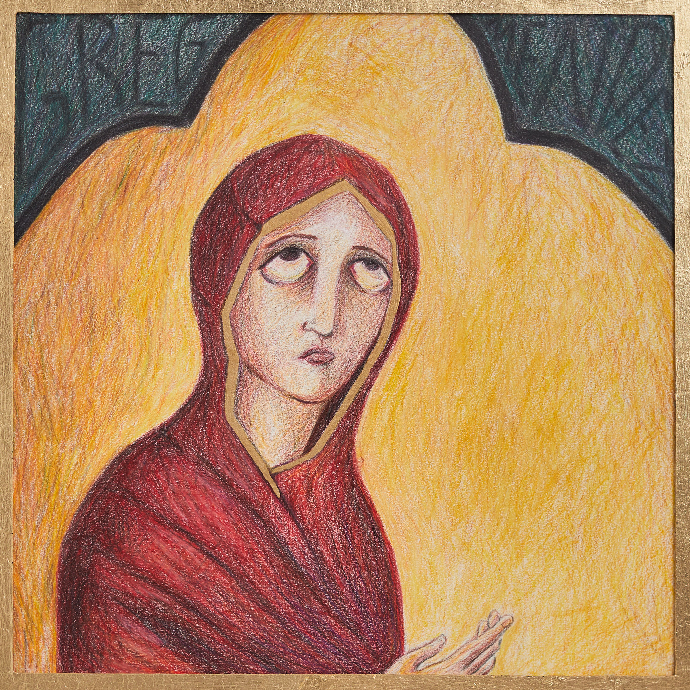
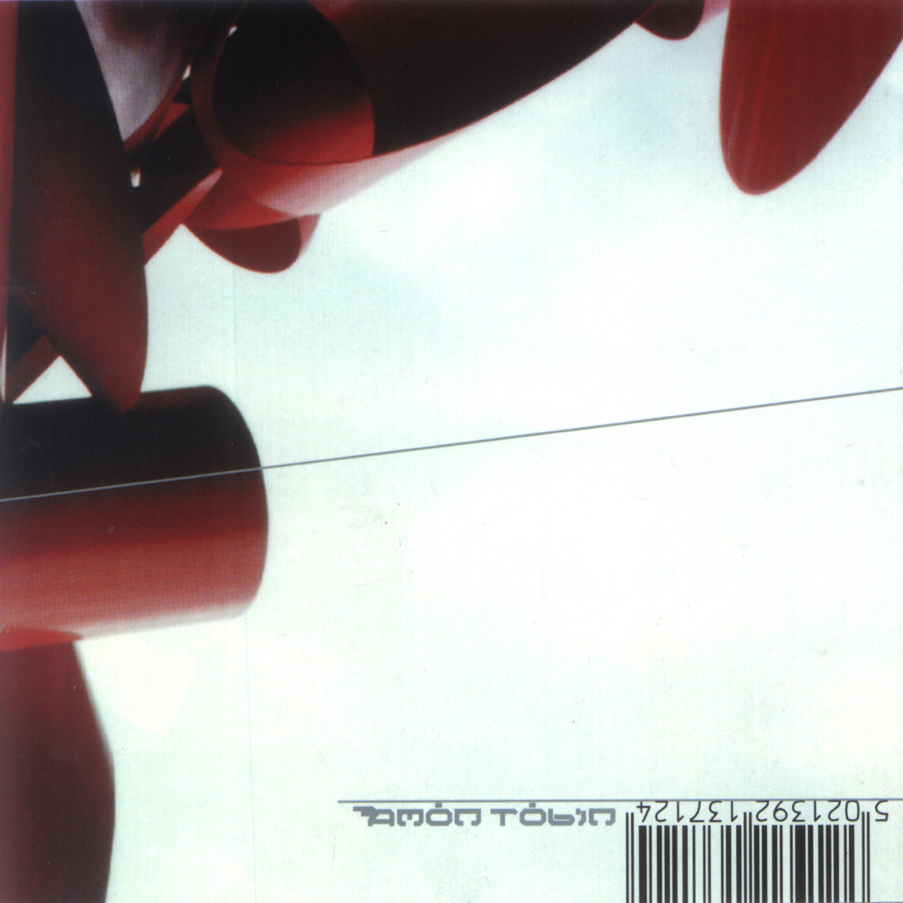

banner: assets/yves2.png

- I know music isn't really visual but this is my website so piss off lol. 
- Every month, I will try to update this page with some records/tracks I've been frequenting. 

- **(Remember you can right-click on the album covers to hear my favorite song on each album)** 

## Mid-April 2026:

*Halo - Tiffany Day*

*choke enough - Oklou*

*Sunburn - Dominic Fike*

*portals//polarities - Night Tapes*

*I Let It in and It Took Everything - Loathe*

*Pandora - Wisp*

## Late-March 2026:

*Easy - Bleary Eyed*

*Hex Dealer - Lip Critic*

*Self Titled - Greg Mendez*

## Early-March 2026:

*Varthamanam - Aksomaniac*

*Adventures in Foam - Cujo*

*Businessmen & Ghosts - Working for a Nuclear Free City*

*Bricolage - Amon Tobin*

*Unakkul Naane - Harris Jayaraj*

*The Facts and the Dreams - Fragile State*

