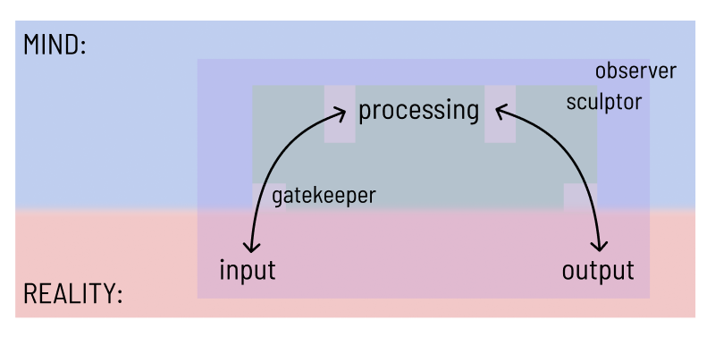
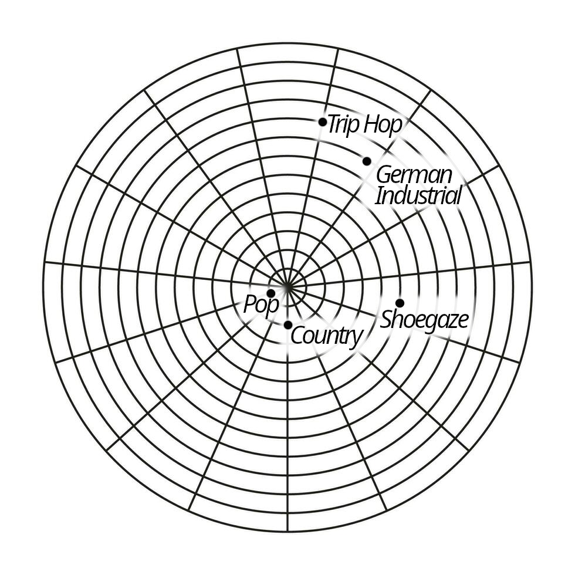

banner: assets/lifemaxxing.jpg

# Sparknotes Version
## What's the Point?
- Being alive is an incomprehensible miracle. The odds of this universe existing, life emerging from it, and your soul being born into that life are so astronomically small that every moment you're alive is something that should not exist. So you can bet I'm going to make the most of it. This whole system is my means of doing exactly that
## The Framework
- Life on a fundamental level is just: input → processing → output, repeated over time. Maximize all three and you've maximized life.
### Time → Improvement
- Time is the backdrop for everything. The biggest evidence of time passing is change, and change compounds. Positive change (improvement) has a near infinite ceiling and bleeds into other areas — get better at language learning and your memory improves across the board. Negative change hits a floor fast. So improvement (over damage) is just the more efficient bet.
### Input/Output → Experience
- Input is reality entering your mind. Output is your mind entering reality. To maximize both you want variety and quantity — a lot of a lot.
- For variety, seek eccentrism over conformity. Niche, esoteric things are much more distinct from one another than conventional things are. You can cover a lot more ground in terms of variety by engaging in distinctly unique things, since they're so different from one another.
- For quantity, be an expert of few. Master of one squanders variety and hits diminishing returns. Jack of all trades overextends and loses depth. A few disciplines, chosen because they vary from each other and suit your biology, gives you the best of both.
### Processing → Stewardship
- Processing is the pipe between input and output. You want what enters one end to not only make it out the other but come out enriched.

- Preventing leakage — baseline stuff. Sleep, diet, exercise, avoiding vices. Keep the pipe intact.
- Adding water — going beyond baseline. Sharpening memory, focus, problem solving. Making the pipe actively add value.

### The Mind's Role
- Input and output are rooted in reality but they pass through your mind — which means how you perceive and act on them is largely under your control. You can warp the representation of reality that enters your mind and the representation of your mind that exits into reality. This is where intentionality becomes everything.
- There are three mental layers that let you do this:

1. **Commander** — the gatekeeper. Chooses what gets into your mind and what gets out. Operates right at the boundary of processing and reality.
2. **Sculptor** — the framer. Warps how things are represented once they're in. A bad grade is either evidence of failure or evidence of learning — the Sculptor decides.
3. **Observer** — the watcher. Steps back and sees all of it from above, informing the other two and catching when they go off track.

- These three work together to build feedback loops that compound on themselves — your beliefs warp your perception, your perception shapes your output, your output reshapes your reality, which feeds back into new input. Get that loop running in the right direction and success becomes self-reinforcing.

Okay, now for the long drawn out explanation...

## What Are You Talking About?
- Lifemaxxing is just a funny term for it. Really, what I mean is trying to optimize life and make the most of it. I will explain the specifics of why and how:

## Why Do Allat?
- The way I see it, the chances of this universe even existing are beyond astronomical. Not only that but for life to even exist is a miracle. On top of that for my soul to be born into that life is infinitely impossible. The sheer magnitude of luck it takes to be alive, even for a split second, is incomprehensible. 
- Every moment I'm alive is another miracle. Every day I wake up is another marvel. 
- So if life is so valuable, you can sure as hell bet that I'll make the most of it. 
- *Disclaimer: So I know that I make these points that living tomorrow is impossible and a miracle, but I do still believe I will be alive for at least a few more years. Stastically speaking I will be alive that long and I will get greater output of life If I live my life that way. For example, if today was my last day on Earth, I definately would not be studying for my Calc midterm. This will all make a bit more sense as I explain my life philosophy.*

## Explanation 
- Okay, so we want to maximize life right? For that, let's define what life is. On a very fundamental level, our behavior goes as following: 1. We take in stimilus 2. We process that stimulus 3. Act based on processing. This is then repeated continously over time. 
- We can distill these into input->processing-output all as a function of time. 
### Time and Improvement
  - So how can you "maximize" time? Well the biggest evidence of the progression of time is change. If an enormous amount of change were to occur, that would lend itself to the conclusion that time has indeed passed. 
    - Note that I'm not saying change is the cause of the passage of time, rather I mean to say that change cannot occur without the passage of time.
  - Great, so bring forth change. Couldn't that mean just become a bum and do nothing? What stops us enacting negative change upon ourselves (destroying our bodies and wasting away our lives)? With negative change, there really is only far you could go. There is only so much damage you can bring forth. However, with the other end, improvement, the ceiling is near infinite, unachievable by any mortal. Here too, the change will begin to compound. What you improve in one area will seek to help another area (If I get really good at language learning, my ability to play chess may also improve as a result of heightened memory capabilities, etc). Therefore, it is more effecient to bring about improvement (positive change) than damage (negative change). 

### Maximizing Process
- Input and output are easy. These can be thought of as vector quantities. They have directions and magnitudes, varieties and quantities. For music, variety would be the genre and quantity would be how much you listened to that genre. Ideally, you would have listened to a lot of a lot intently*.
- Processing acts as the bridge between these two. It is a means to the end of maximizing the other two. Think of it as a pipe, we want that which enters from one side to make it to the other with not only no leakage, but with even more water than was originally. The quantity of water represents the quality of that which enters and exits. Vices like engaging in substance abuse detrimentally effect the amount of water that passes through. There begins to be leakages in that which entered. We want this sytem to be ideally the most effecient. There is two layers here: preventing leakage and adding water. 
  - Preventing Leakage: Consists of ensuring baselines like sleep, excercise, diet, etc are taken care of. 
  - Adding Water: This means going beyond the baseline to add more value to that which you inptu and output. Increasing memory or ability to problem solve or enhancing focus, etc. 

- Time calls for improvement, input/output calls for experience, and processing calls for stewardship. Time is kind of the pretext for all else, it sets the scene, saying we need to seek improvement so that we can get the most out of life. Input/output defines life and processing is the bridging factor of all the 3. 

#### *Eccentrism Over Conformity (Variety)
- By nature of variety (in input/output) it is more optimal to seek out and do that which is unconventional. The difference between 2 items that are conventional, close to the center, is little. As you go further outward, seeking niche and esoteric things, the difference between each thing becomes vast. Sticking to only the conventional is redundant since you would be getting similar input or output. The distance you travel in the movement from one thing to another in the conventional (close to the center) would be incredibly little. However, with more far out things, the difference from thing to thing is much greater meaning a miuch more distinct, unique, and fulfilling input and output.
  - So here I must note that not always is the conventional/popular directly in the center. The center indicates a mishmosh of all that surronds it. For the sake of my explanation and the observation of these principles, it helps to think this way although it is not unilateraly accurate. 
  - I will liken this to music to make it easier to understand. In the center is pop music (I'm thinking mainly Taylor Swift or Sabrina Carpenter). The difference you get in your traversal at the center from pop music to maybe country is very little. You covered little ground. Imagine though traveling from shoegaze to german industrial and then to trip hop. These are all so distinct that the difference between them is inherently greater than that between country and pop.
  

  
  - Mainly, as things become more distinct, the difference amongst one thing to another is much greater. This was a very long drawn out way of saying that but if one thing is very different and another thing is very different, the distance between them will likely be greater than 2 that are closer to the norm.
#### Expert of Few (Quantity)
- In terms of quantity, I'm a believer in neither master of one or jack of all trades. This is more easily identifable with output but also can be applied in input. 
- Master of one maximizes quantity but fails in variety. Also, because of the law of marginal, diminishing returns, the output reached after a point is squandered. 
- Jack of all trades' failure lies in overextension. Not focusing on a few things leads to lower output than would be possible. This is the opposite issue of master of one: focusing too much on variety and not enough on quantity.  
- I like something I call "expert of few". Becoming very good at a few things, not so many things that you lose focus but not too little that your output is squandered because of the law of marginal diminishing returns. It also helps that the disciplines you choose vary from one another and are those you can get the most output out of given your biology/conditions. It also helps if the skills built from those disciplines are widely applicable so you can get even more "bang for your buck" so to say. I talk about my few in the previous blog post.
### Our and Their Relationship
- Now that I've explained time and the 3 parts, I must explain the relationship we have with these parts and the relationship they have with each other. I'll kind of disregard time for now since thats ever-permanent and always present.
#### Mental and Physical Planes
- Aspects of the 3 exist on the mental plane and others exist on the physical plane. 
- Input and output are rooted in reality. Input is what actually exists in reality and output is physically the actions you perform. I like to think of input as bringing representations of reality into the mind and output as representations of the mind into reality. Actions are just decisions manifested and even abstract concepts written about or ideated upon are pulled from the mind. 
- The transitions from input to processing and processing to output partialy also exist in the mind. It's undeniable what exists in front of you in reality but you can perceive it in a certain way as to warp the input that enters processing. The original input hasn't changed, just the representation of it that entered your mind and processing has. Similarly, you can do the same for output. This is much more commonly seen and easier to relate with. It becomes very easy to delude yourself into believing the actions you are taking are different than the actions you are taking. 
##### How to Reality-Warp
- So I want to talk more about this delusion and how it can actually help you. THe way in which you view your actions and reality can just affirm a positive feedback loop that compounds success (whether it be success in this life system or the traditional life view). I will explain this feedback loop in a bit.
- Since so much of this whole system is with respect to your mind, so much of it is under you control. Essentially your self-belief and delusions can warp reality as you see it and that's exactly what you need to enter these feedback loops. Ideally, you'd begin a more concious change and through neuroplasticity over time, this change will become semi-permanent/permanent. 
##### Feedback Loop
- Something that needs to be noted is that these parts all effect one another beyond in the linear fashion I explained. Its not just input effects processing which effects output. Output also effects the input you take in and the processing you have and the processing effects the input. All of these things are interwoven. 
- Because of this relationship, you can build positive feedback loops that affirm what you believe and bring you closer to achieving your goals.
##### Create Masks of Self 
- It is very important that you cultivate the ability to choose, warp, and distantly observe what input you take in and what output you let out.
- These 3 tasks are handled by the 3 masks of the mind as I like to call it. They are distinct illusions created by the mind to represent the 3 types of mental activity. Becoming aware of these different masks you can use them very intentionally to further our goals. 

1. Commander (Gatekeeping): Chooses what enters the mind and what exits the mind/processing. This is the closest layer to processing and exists only in the mental plane. Its the final gatekeeper.
2. Sculptor (Framing): Warps all that exists in the mental plane. Warps the representations of reality that enter the mind (input) and the reprensetations of the mind that are set to enter reality (output). Also warps processing of input for output. 
3. Observer (Metacognition): Distantly observes everything, reality and mind and processing. All. Observes and measures to inform the other masks and enact change. 

- Being very intentional with what and how things enter and exit your mind is incredibly powerful. 

# System Within the Context of Others
- An idea I am workshopping is one that deals with this whole philosophy in the context of others. 
- To maximize life and its usage, you must maximize the living of that life and the impacts felt by it The internal aspect (living of the life) was the one discussed above. I intend to delve into the external aspect (making the impact of the life felt). 
## Impacting the Material World
- One way is to put forth things into nature and the world that change the state of existance in some manner. This would be creating things and putting them out into the world. 
## Impacting People
- However, more effecient than this, is impacting people. People are living, and the impacts you make on that impact other people and those people impact other people, compounding over time. This yields insane levels of impact as compared to directly altering the world. Not to mention, these people will then go on to directly impact the state of the world as well. 

- So evidently, our main goal should be impacting people (change may be enacted upon the state of the material world as a byproduct of this)
- We should seek to develop our skills and ourselves in the most effeceint way to get to a point where we can effect the largest amount of people as deeply as posible. Callback to the idea of quality and quanitty, Impact a lot of people very deeply. 

### How Can We Impact People?
- But How? how can we impact people's lives? Well, how perfect. We already defined living life: Input, processing, output. So you must try to maximize other people's input, processing, and output. 

### Examples
- This is all a bit abstract so I'll give some examples. 
- I aim to get good enough at art and design so much so that I can go on to teach art, thus providing input to a number of people.
- I intend to use code and circuits to build technology and tools for people to more effecitvely bring their visions to life. Facilitating that gap between processing and output for people. 
- Pursuit of philosophy and refining thought to provide input for people to better hone their processing. 
- Entering research as a career to discover new technologies and expand the frontier of humanity to better improve the livelihood of others and facilitate their input-processing-and output. More effecient at improving human condition than limiting myself to creating a singular thing. Discovery of the underlying technology has potential for greater benefit.

## Idealogy
- Its helpful to think of things as beyond yourself. Being lazy is selfish. This is an idealogy I got from Max Panchowski. You have these skills and potential that is meant to be developed to help so many people outside of yourself. To squander that wouldn't just be dissapointing but also a failing of all those people. Maybe because you stopped making that rudimentary python program, the next Steve Jobs never saw it on some archived forum and never was inspired to make the next world-defining software. You have a part to play in this world. Play it.
